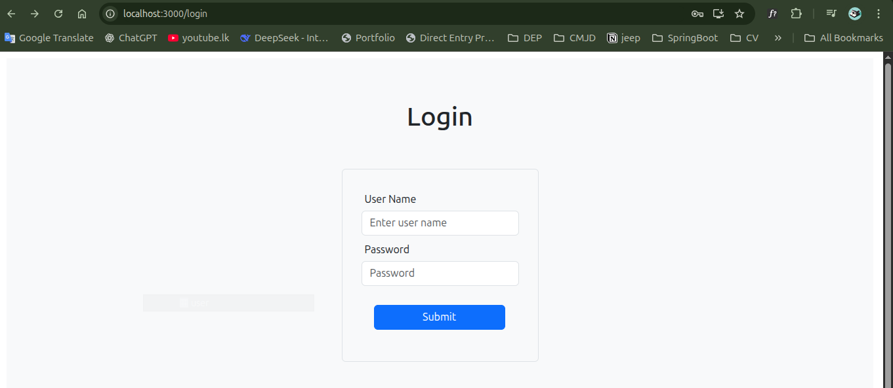
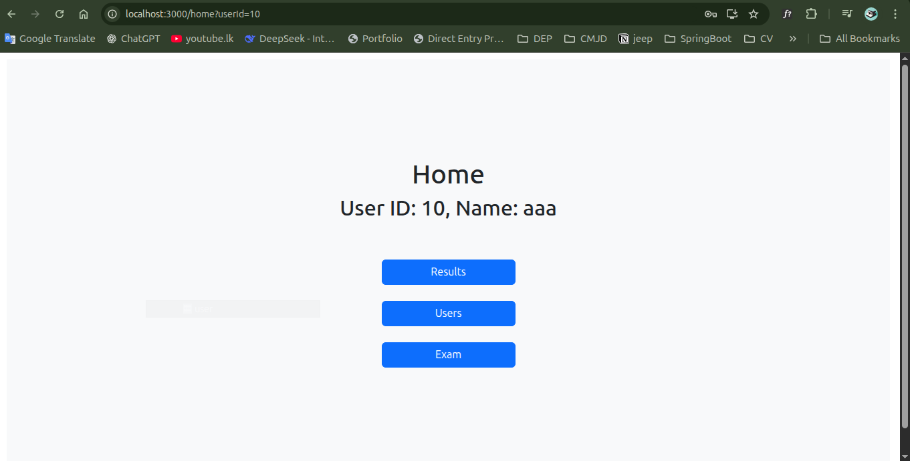
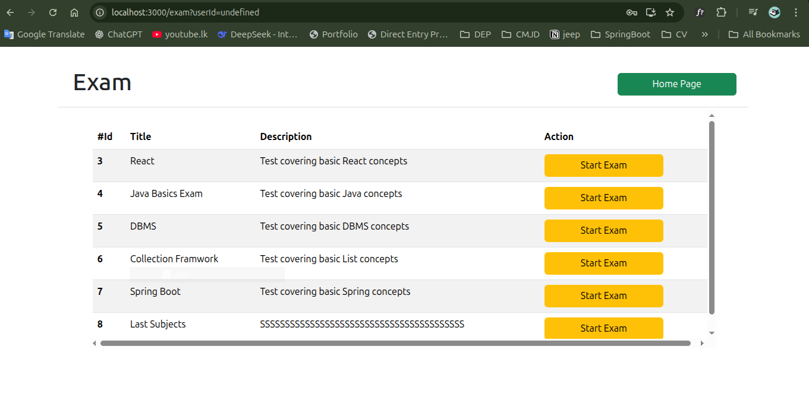
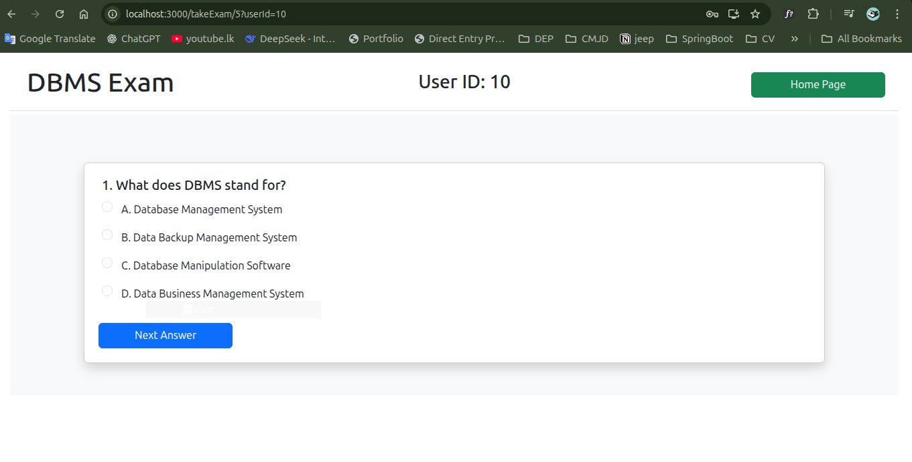
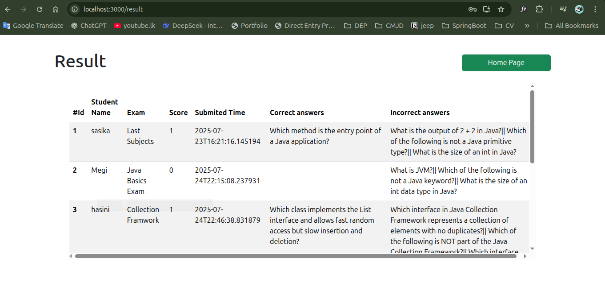
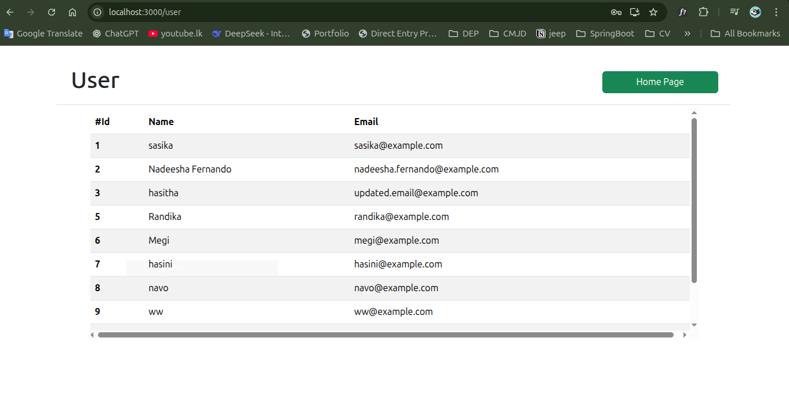

# 🖥️ Online MCQ System - React Frontend

This is the frontend implementation of the **Online MCQ Exam System** built using **React.js**. It is developed as part of an internship technical assignment and communicates with a Spring Boot backend to deliver a functional MCQ examination experience.

## 🚀 Features

- ✅ Static Login Page
- 📄 View exam List
- ❓ 5 questions per paper
- 📩 Submit selected answers one by one
- 📊 View results with:
  - Total score
  - Correct/Incorrect answers

## 🌐 Live Demo / Hosting
Currently hosted and tested locally. See below for setup instructions.

## 📸 Screenshots

> Login


> Home Page  


> Exam List  


> Take Exam  


> Score Page  


> Result List  


> User List 



## 🛠️ Technologies Used

- **React.js**
- **Axios** – API communication
- **React Router DOM** – Client-side routing
- **Bootstrap** – Styling and responsive layout

## 🔗 Backend Repository

Spring Boot-based backend:
👉 [online-mcq-system-spring](https://github.com/sasikad1/online-mcq-system-spring)

## 📂 Folder Structure Overview

```plaintext
online-mcq-system-react/
├── public/
├── src/
│   ├── css/          # Custom stylesheets
|   |── screenshots/
│   ├── pages/        # Exam, Login, Result, 
|   |── Index/    
│   └── App.js
├── README.md
└── package.json
```

## 🧪 Sample User

No real authentication. You can click the **Login** button directly to enter.

---

## 🏃‍♂️ How to Run the App

```bash
# Clone the repository
git clone https://github.com/sasikad1/online-mcq-system-react.git

# Navigate to the project folder
cd online-mcq-system-react

# Install dependencies
npm install

# Start the development server
npm start
```

Make sure your backend Spring Boot server is running on [http://localhost:8081](http://localhost:8081).

---

## 📩 API Base URL Configuration
If needed, update the backend URL in your axios calls (e.g., http://localhost:8081/api/...).

## 📚 Assignment Objectives
This project was built to fulfill the following requirements:

View available exams

Attempt MCQ questions (one-by-one)

Submit answers

View total score and detailed results

Bonus: Clean UI & user feedback

## 📌 License
This project is open-source and built solely for educational and demonstration purposes.

---

---

## 📞 Contact Me

**Developed by:** Sasika Dilum  
**Email:** [sasikadilum40@gmail.com](mailto:sasikadilum40@gmail.com)


